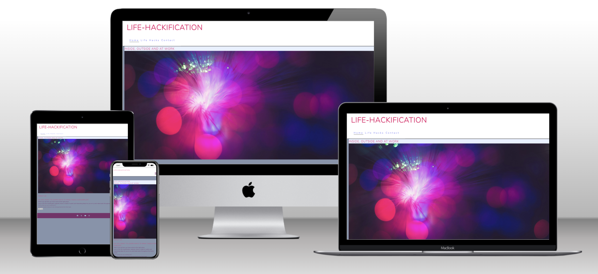
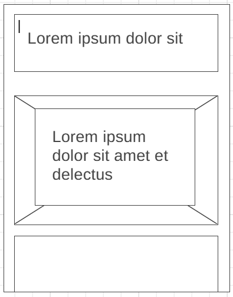
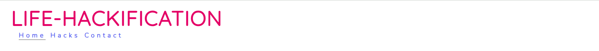
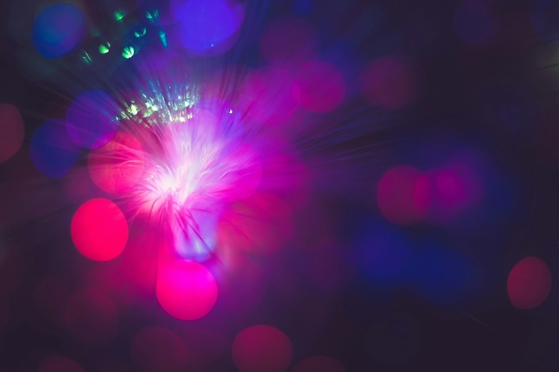
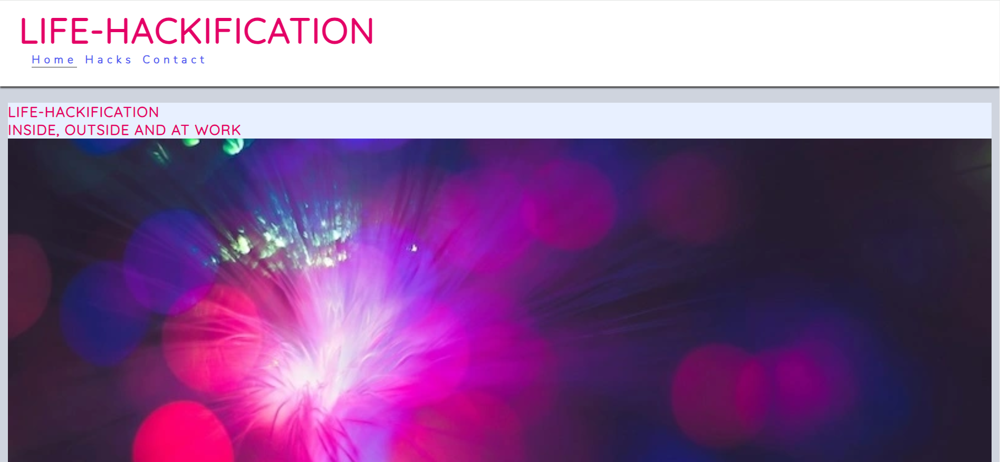
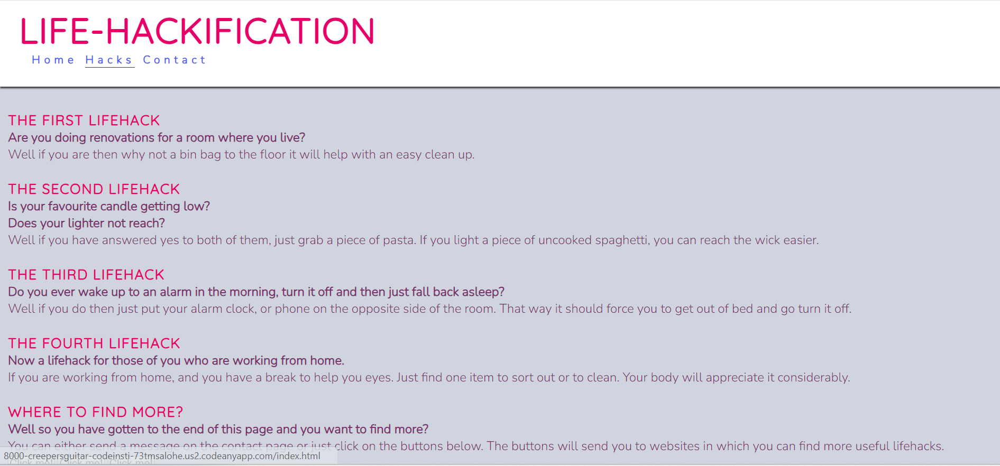
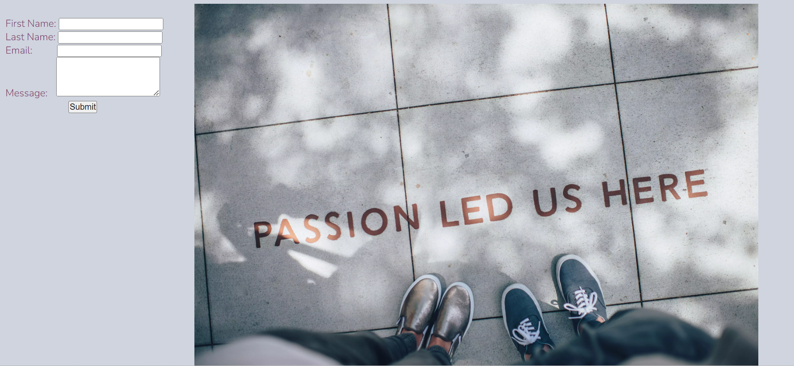
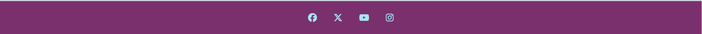

# Life-Hackification

This is the Life-hackification website. A website designed and targeted for people who are seeking new and fun ways to improve daily tasks.

Visit the live site [here](https://creepersguitar.github.io/Codeinstitute-project-1/)

## Contents
1. [Design](#design)
2. [Features](#features)
3. [UX](#ux)
4. [Testing](#testing)
5. [Sources](#sources)
6. [Credits](#credits) 

## Design

The website was created with persons in mind who, would like to find new quicker ways to help with daily tasks which could be a pain the way they are originally doing them.

### Wireframe Designs
The wireframes were made with [Wireframe.cc] (https://wireframe.cc/)

### Font Choices
**Fonts:** 'Nunito' was chosen for the body of the website as it makes the website have a professional look while also maintaining the usefulness of the website.
'Quicksand' was chosen for the heading sections of the website as it makes it appeal to the younger community while also maintaining a professional look.
### Colour Choices
**Colours** The colour pallete was generated using [coolors.co]
(https://coolors.co) The base colour was picked out to help give contrast to the hero image (taken from unsplash) which shows a light with a mixture of purple and pink faded spots.
This particular colour palette was chosen for its calmimg, warm purple tones.

### Images
**Images:** Besides the hero image of the purple light, there is only one other image which says "passion led us here" in a shadow of a person.
## Features
The site has features of a static website.
- **Nav Bar**
    - The navigation bar is always visible on all pages. In the top left corner is the name of the website which is a link to bring the user back to the home page.
    - The currently active page is underlined in the header.
    - Regardless of the screen format, the navigation bar is constant in one line while being spaced out.

- **Hero Image**
    - The hero image was chosen as i wanted something calm and inviting to make the users want to scroll down the home page.

- **Main Section**
    - Subheaders on all pages to help give cues about the content to the users on each page.
    - Varied content depending on the page
    - Information kept short to help the user find information quickly

- **Home page**

    - The picture of the faded purple light greets the user to give them a warm, calm welcome.
    - The layout is vertical on smaller screens and horizontal to make use of the larger screens such as laptops.

- **Hacks Page**

    - The hacks are related to some of the many daily tasks that can get quite annoying.
    - The information that site visitors will look for is listed in a clear, easy to understand paragraph format. This is making use of subheadings and break lines to help give the user time to read each hack.
    - The layout is vertical on smaller screens and horizontal to make use of the larger screens such as laptops.

- **Contact page**

    - A form encourages the user to leave a message of support, a new hack or some improvements to the site.
    - The image on the contact page helps to make the users smile after reading about the lifehacks and filling in the form.

- **Footer**
    - The footer contains three icons which link to external social media pages.
    - The links will open in new tabs to allow the user easy access to come back to the site.
    - The footer is consitant throughout each page.
    

###  Potential Future Features
    -
    -
    -
    -

## UX

## Testing

### Validation Testing

## Sources

- Love Running walk-through project for basic structures for the header and footer aswell as part of the css structure.
- Favicon was generated using [Favicon.io] (https://favicon.io/)
- The mock-up image of the live website generated on different devices was using [techsini.com] (https://techsini.com/multi-mockup/)
- All images taken from [unsplash.com] (https://unsplash.com/)
- Images were converted using [Cloudconvert.com] (https://cloudconvert.com/)
- Images were compressed using [youcompress.com] (https://www.youcompress.com/webp/#google_vignette)
- Icons were taken from [fontawesome.com] (https://fontawesome.com/)
- Hack 1 was taken from [buzzfeed.com] (https://www.buzzfeed.com/sarahaspler/life-hacks-september-2023)
- Hack 2 was taken from [familyhandyman.com] (https://www.familyhandyman.com/list/life-hacks-youll-wish-you-knew-sooner/)
- Hacks 3 and 4 were also taken from [buzzfeed.com] (https://www.buzzfeed.com/rossyoder/effective-life-hacks)
- The Structure of this README file from [MariaHochstoeger] (https://github.com/MariaHochstoeger/project1)
- The wireframes were designed using [Wireframe.cc] (https://wireframe.cc)
## Credits
- https://www.w3schools.com/tags/tag_textarea.asp for helping me figure out how to allow users to enter more than one line within the contact form
- https://www.w3schools.com/css/css3_transitions.asp#:~:text=ease%20%2D%20specifies%20a%20transition%20effect,effect%20with%20a%20slow%20end for giving me something new to work with within the css code to style the nav bar
- https://www.w3schools.com/css/css_background_image.asp for helping me with understanding the background-image css code more and allowing me to add an image within any section needed.
- https://www.w3schools.com/tags/att_input_autocomplete.asp for helping me allow search engines to autocomplete parts of the contact us form
- My mentor, Spencer Barribal, for his input